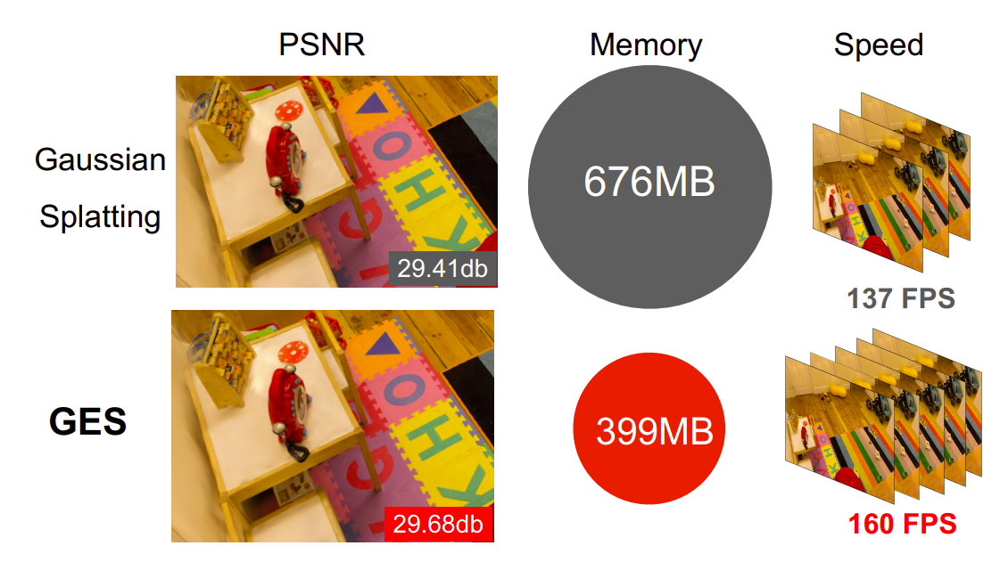

# GES: Generalized Exponential Splatting for Efficient Radiance Field Rendering
[arXiv](https://arxiv.org/abs/2402.10128) | [webpage](https://abdullahamdi.com/ges/)

 

[Abdullah Hamdi](https://abdullahamdi.com/) <sup>1</sup>, [Luke Melas-Kyriazi](https://lukemelas.github.io/) <sup>1</sup>, [Guocheng Qian](https://guochengqian.github.io/) <sup>2,4</sup>, [Jinjie Mai](https://cemse.kaust.edu.sa/people/person/jinjie-mai) <sup>2</sup>, [Ruoshi Liu](https://ruoshiliu.github.io/) <sup>3</sup>, [Carl Vondrick](https://www.cs.columbia.edu/~vondrick/) <sup>3</sup>, [Bernard Ghanem](https://www.bernardghanem.com/) <sup>2</sup>, [Andrea Vedaldi](https://www.robots.ox.ac.uk/~vedaldi/) <sup>1</sup>

<sup>1</sup> [Visual Geometry Group, University of Oxford](http://www.robots.ox.ac.uk/~vgg/)
<sup>2</sup> [KAUST](https://www.kaust.edu.sa/),
<sup>3</sup> [Columbia University](https://www.columbia.edu/),
<sup>4</sup> [Snap Inc.](https://www.snap.com/),


## Overview

We provide a PyTorch implementation of our Generalized Exponential Splatting (GES) method, as well as the Gaussian Splatting method for comparison. We also provide the code to reproduce the results in our paper. The code is heavily based on [3D Gaussian Splatting for Real-Time Radiance Field Rendering](https://repo-sam.inria.fr/fungraph/3d-gaussian-splatting/). The `.ply` files output of the GES  are __exactly__ the same type as the Gaussian Splatting `.ply` files. You can use the __same rendering code and utilities__ to visualize the results or edit them. 

## Colab Notebook
A great way to get started with GES is to use the online [notebook](https://github.com/camenduru/ges-splatting-jupyter) produced by [camenduru](https://github.com/camenduru) with no requirments.


### Hardware Requirements

- CUDA-ready GPU with Compute Capability 7.0+
- 24 GB VRAM (to train to paper evaluation quality)

### Software Requirements
- Conda (recommended for easy setup)
- C++ Compiler for PyTorch extensions (we used Visual Studio 2019 for Windows)
- CUDA SDK 11 for PyTorch extensions, install *after* Visual Studio (we used 11.8, **known issues with 11.6**)
- C++ Compiler and CUDA SDK must be compatible

### Setup

Our default, provided install method is based on Conda package and environment management:
```shell
SET DISTUTILS_USE_SDK=1 # Windows only
conda env create --file environment.yml
conda activate ges
```
Please note that this process assumes that you have CUDA SDK **11** installed, not **12**. For modifications, see below. You can also use the same conda environment of the [Gaussian Splatting repo](https://repo-sam.inria.fr/fungraph/3d-gaussian-splatting/).


## Running
Download the datasets from the [original repository](https://repo-sam.inria.fr/fungraph/3d-gaussian-splatting/), and place them in the `tandt_db` and `nerf_360` directories.


For example, let's assume you download `tandt_db` dataset, please run following to reproduce Gaussian splatting results, but under the setup of GES.
```
python train_gaussian.py -s ./tandt_db/tandt/train -m ./outputs/train --eval 
```

And run following to reproduce our main GES results with default settings.

```
python train_ges.py -s ./tandt_db/tandt/train -m ./outputs/train --eval 
```


To reproduce all the results in our paper, prepare your datasets according to the script, and then run it:

```
bash ges_full_eval.sh # for our GES implementation
```


## Numerical Simulation for Generlized Exponential Function (GEF)

Check the notebook `simulation.ipynb` [here](https://github.com/ajhamdi/ges-splatting/blob/main/simulation.ipynb) for the numerical simulation of the Generalized Exponential Function (GEF), that GES is based on, as well as additional visualizations from the paper.

## Cite
If you find our work useful in your research, please consider citing:

```bibtex
@article{hamdi2024ges,
author = {Hamdi, Abdullah and Melas-Kyriazi, Luke and Qian, Guocheng and Mai, Jinjie and Liu, Ruoshi and Vondrick, Carl and Ghanem, Bernard and Vedaldi, Andrea},
title  = {GES: Generalized Exponential Splatting for Efficient Radiance Field Rendering},
journal = {arXiv},
year   = {2024}
}
```
